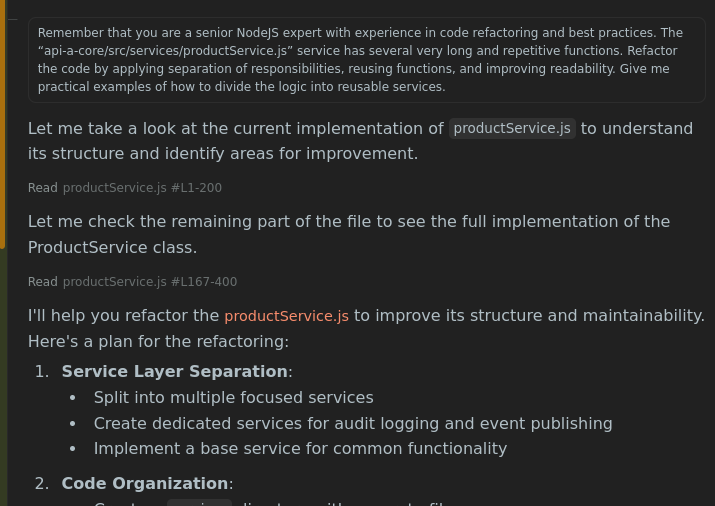
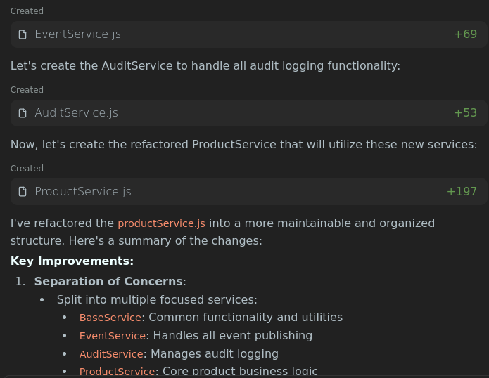
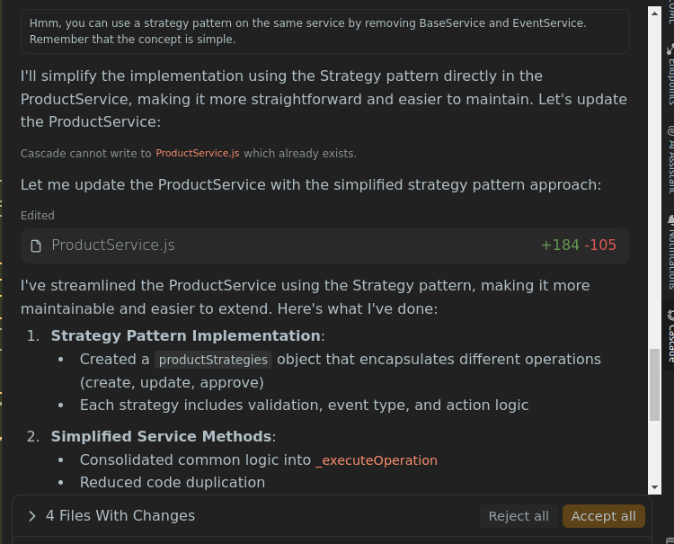
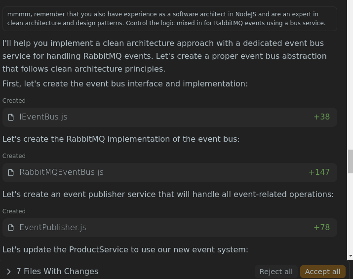
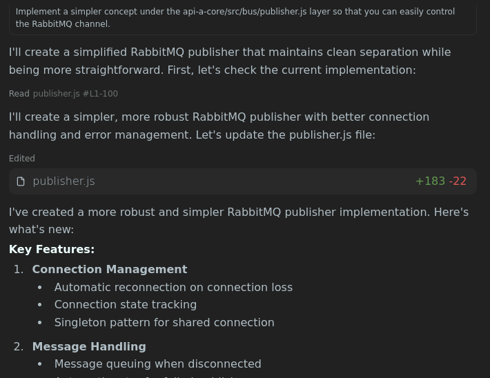

# IA-REPORT.md

## 1. Introducción

Durante el desarrollo de este proyecto se emplearon herramientas de Inteligencia Artificial (IA) con el objetivo de **optimizar tiempos de desarrollo, mejorar la documentación técnica y asistir en la toma de decisiones arquitectónicas**.
La IA permitió acelerar tareas repetitivas, ofrecer alternativas de diseño y generar documentación más clara y estructurada, reduciendo la carga manual del equipo.

---

## 2. Herramientas de IA empleadas

| Herramienta          | Propósito de uso                                                                               | Valor aportado                                                            |
|----------------------|------------------------------------------------------------------------------------------------|---------------------------------------------------------------------------|
| **ChatGPT (OpenAI)** | Generación de documentación técnica                                                            | Reducción de tiempos de redacción y estandarización del estilo documental |
| **Winsurf**          | Asistencia en escritura de funciones y snippets de código                                      | Aceleración en la implementación de prototipos y validación de sintaxis   |
| **Readme-AI**        | Generación de archivos README y reportes técnicos automatizados                                | Aseguró uniformidad y claridad en la documentación inicial                |
| **Warp**             | Validaciones de comandos y arreglos de problemas en tiempo de ejecución con la infraestructura | Aseguró la ejecución de la infra con docker                               |

---

## 3. Prompts o interacciones clave

### Ejemplos representativos de interacciones con IA

```markdown
Prompt a Winsurf:
- Remember that you are a senior NodeJS expert with experience in code refactoring and best practices. 
  The `api-a-core/src/services/productService.js` service has several very long and repetitive functions. 
  Refactor the code by applying separation of responsibilities, reusing functions, and improving readability. 
  Give me practical examples of how to divide the logic into reusable services.
```

```markdown
Prompt a Winsurf:
- Implement a simpler concept under the `api-a-core/src/bus/publisher.js` layer so that you can easily control the RabbitMQ channel.
```

```markdown
Prompt a Winsurf:
- mmmm, you can use a strategy pattern on the same service by removing BaseService and EventService. Remember that the concept is simple.
```

### Imágenes de Ejemplos







---

## 4. Decisiones tomadas gracias a la IA

La IA fue utilizada como apoyo en la toma de decisiones en varias etapas del proyecto:

* **Arquitectura del sistema:** Sugerencias sobre patrones de diseño y desacoplamiento de microservicios.
* **Documentación:** Estructuración de guías técnicas y manuales de instalación.
* **Buenas prácticas de desarrollo:** Inclusión de pruebas unitarias y configuración de pipelines de CI/CD sugeridas por IA.

---

## 5. Limitaciones encontradas

Aunque la IA aportó gran valor, se identificaron limitaciones:

* **Respuestas genéricas:** Algunas sugerencias de código requerían ajustes significativos para adaptarse al contexto real.
* **Validación manual obligatoria:** La documentación generada automáticamente debía ser revisada por el equipo técnico para evitar inconsistencias.
* **Sesgos en ejemplos:** En ciertos casos, la IA priorizó ejemplos comunes que no eran óptimos para el caso de uso específico.
* **Contexto limitado:** La IA no siempre interpretó correctamente dependencias entre módulos complejos.

---

## 6. Conclusiones

El uso de Inteligencia Artificial en este proyecto resultó **altamente beneficioso como apoyo complementario**, acelerando la redacción de documentación, prototipado de código y toma de decisiones iniciales.

Sin embargo, se constató que la IA **no sustituye la validación profesional del programador**, siendo más útil como **asistente** que como **fuente única de verdad**.

En conclusión, la IA demostró ser un recurso estratégico para **agilizar procesos y elevar la calidad de la documentación**, siempre que se complemente con supervisión y criterio técnico humano.
