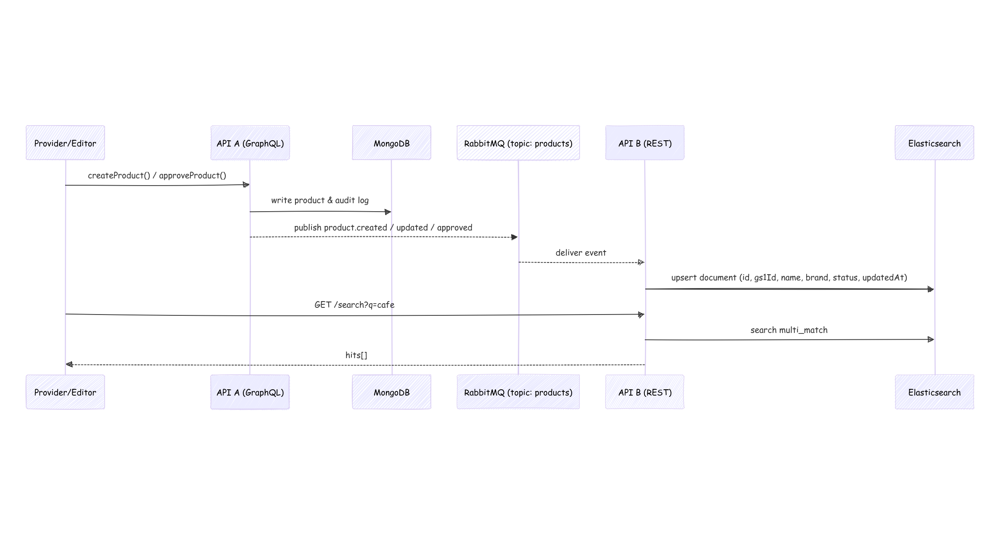

# Prueba Técnica de API de Productos

Un sistema de gestión de productos basado en microservicios con API GraphQL, indexación en tiempo real mediante RabbitMQ y capacidades de búsqueda con Elasticsearch.

[Reporte sobre el uso de Agentes de IA](IA-report.md)

## Arquitectura

- **API-A-Core**: API GraphQL para gestión de productos (Node.js)
- **API-B-Search**: API RESTful de búsqueda con Elasticsearch (TypeScript/Node.js)
- **Base de datos**: MongoDB para almacenamiento de productos
- **Motor de búsqueda**: Elasticsearch para búsqueda de texto completo
- **Cola de mensajes**: RabbitMQ para indexación en tiempo real


## Diagrama de Secuencia



## Requisitos Previos

Asegúrate de tener instalado:

- Node.js (v20+)
- MongoDB
- Elasticsearch
- RabbitMQ
- npm (v10+)

## Estructura del Proyecto

```
.
├── api-a-core/          # Servicio de API GraphQL
├── api-b-search/        # Servicio de API de búsqueda
├── resources/           # Scripts y utilidades
├── shared/              # Definiciones de eventos compartidos
└── docker-compose.yml   # Servicios Docker (opcional)
```

## Ejecutando la Aplicación

### Opción 1: Docker (Correr los servicios en contenedores Docker)

```bash
# Iniciar todos los servicios con docker
docker-compose up --build -d

# Verificar estado de los servicios
docker-compose ps

# Ejecutar datos de prueba
chmod +x resources/seed.sh
./resources/seed.sh
```

### Opción 2: Local

#### Configuración del Entorno

**API-A-Core** (`api-a-core/.env`):

> [!IMPORTANT]
> Copia el contenido del archivo `api-a-core/local.env.example` a `api-a-core/.env` y actualiza los valores según sea necesario.

```bash
NODE_ENV=development
MONGO_URI=mongodb://localhost:27017/products
JWT_SECRET=dev-secret
RABBITMQ_URL=amqp://localhost:5672
RABBITMQ_EXCHANGE=products
PORT=4000
```

**API-B-Search** (`api-b-search/.env`):

> [!IMPORTANT]
> Copia el contenido del archivo `api-b-core/local.env.example` a `api-b-core/.env` y actualiza los valores según sea necesario.

```bash
NODE_ENV=development
ELASTIC_URL=http://localhost:9200
RABBITMQ_URL=amqp://localhost:5672
RABBITMQ_EXCHANGE=products
RABBITMQ_QUEUE=products-search
PORT=3001
```

#### Linux: Configuración Automatizada

> [!NOTE]
> Para sistemas Linux (Ubuntu/Debian/Linux Mint), usa los scripts proporcionados:

**1. Instalar, configurar e iniciar todos los servicios:**
```bash
# Instalar MongoDB, Elasticsearch, RabbitMQ y Node.js
chmod +x resources/quick-start.sh
./resources/quick-start.sh
```

**2. Iniciar las APIs (en terminales separadas):**

**Terminal 1 - Iniciar API GraphQL:**
```bash
cd api-a-core
npm run dev
# La API estará disponible en http://localhost:4000
# Endpoint GraphQL: http://localhost:4000/graphql
# Verificación de estado: http://localhost:4000/health
```

**Terminal 2 - Iniciar API de Búsqueda:**
```bash
cd api-b-search
npm run dev
# La API estará disponible en http://localhost:3001
# Endpoint de búsqueda: http://localhost:3001/search?q=<consulta>
# Verificación de estado: http://localhost:3001/health
```

**3. Ejecutar datos de prueba:**
```bash
chmod +x resources/seed.sh
./resources/seed.sh
```

> [!NOTE]
> Si no prefieres la configuración manual o no estás usando Linux, usa la versión con Docker

## Endpoints de la API

### API GraphQL (Puerto 4000)

**Endpoint:** `http://localhost:4000/graphql`

#### Consultas

```graphql
# Obtener un producto por ID
query {
  product(id: "id_del_producto") {
    id
    gs1Id
    name
    description
    brand
    manufacturer
    netWeight
    status
    createdByRole
    createdAt
    updatedAt
    history {
      id
      action
      changedBy
      createdAt
    }
  }
}
```

```graphql
# Obtener lista paginada de productos
query {
  products(page: 1, limit: 10) {
    total
    page
    pages
    items {
      id
      gs1Id
      name
      description
      brand
      status
      createdByRole
    }
  }
}
```

#### Mutaciones

```graphql
# Crear producto (requiere cabecera x-role: PROVIDER o EDITOR)
mutation {
  createProduct(input: {
    gs1Id: "GS1-001"
    name: "Nombre del Producto"
    description: "Descripción del producto"
    brand: "Marca"
    manufacturer: "Fabricante"
    netWeight: "500g"
  }) {
    id
    status
    gs1Id
    name
  }
}
```

```graphql
# Actualizar producto (requiere cabecera x-role: PROVIDER o EDITOR)
mutation {
  updateProduct(id: "id_del_producto", patch: {
    name: "Nombre actualizado"
    description: "Descripción actualizada"
  }) {
    id
    name
    description
  }
}
```

```graphql
# Aprobar producto (requiere cabecera x-role: EDITOR)
mutation {
  approveProduct(id: "id_del_producto") {
    id
    status
  }
}
```

```graphql
# Eliminar todos los productos
mutation {
  clearProducts {
    success
  }
}
```

**Cabeceras de rol:**
- `x-role: PROVIDER` - Puede crear productos (estado: PENDING), actualizar productos propios
- `x-role: EDITOR` - Puede crear productos (estado: PUBLISHED), actualizar cualquier producto, aprobar productos

### API de Búsqueda (Puerto 3001)

**Endpoint de búsqueda:** `http://localhost:3001/search?q=<consulta>`

**Ejemplo de respuesta:**
```json
{
  "hits": [
    {
      "id": "id_del_producto",
      "score": 2.5,
      "name": "Nombre del producto",
      "brand": "Marca",
      "description": "Descripción del producto"
    }
  ],
  "total": 1,
  "took": 5
}
```

## Pruebas

### 1. Verificación de estado

```bash
# Verificar estado de todos los servicios
curl http://localhost:4000/health  # API GraphQL
curl http://localhost:3001/health  # API de Búsqueda
curl http://localhost:9200/_cluster/health  # Elasticsearch
sudo rabbitmqctl status  # RabbitMQ
```

### 2. Ejecutar datos de prueba

Ejecuta el script de datos de prueba incluido para poblar el sistema con datos de prueba:

```bash
cd resources
chmod +x seed.sh
./seed.sh
```

El script de datos de prueba hará lo siguiente:
- Eliminará los datos existentes de MongoDB y Elasticsearch
- Creará productos de prueba con diferentes roles (PROVIDER y EDITOR)
- Probará la lista de productos mediante GraphQL con paginación
- Probará la funcionalidad de búsqueda con acentos
- Verificará la indexación en tiempo real mediante RabbitMQ

### 3. Ejecutar la suite de pruebas completa

Ejecuta todas las pruebas, incluyendo pruebas de integración:

```bash
-
```

Esta suite de pruebas completa incluye:
- Verificación de estado de todos los servicios
- Ejecución de datos de prueba
- Pruebas de endpoints de API
- Verificación de flujo de mensajes de RabbitMQ
- Verificación de indexación de Elasticsearch
- Pruebas de funcionalidad de búsqueda

### 3. Ejemplos de pruebas manuales

#### Crear un producto (rol PROVIDER)

```bash
curl -X POST http://localhost:4000/graphql \
  -H 'Content-Type: application/json' \
  -H 'x-role: PROVIDER' \
  --data '{
    "query": "mutation($input: ProductInput!) { createProduct(input: $input) { id status gs1Id name } }",
    "variables": {
      "input": {
        "gs1Id": "GS1-TEST",
        "name": "Nombre del producto",
        "brand": "Marca",
        "description": "Descripción del producto",
        "manufacturer": "Fabricante",
        "netWeight": "100g"
      }
    }
  }'
```

#### Buscar productos

```bash
# Buscar productos que contengan "café"
curl "http://localhost:3001/search?q=café"

# Buscar productos que contengan "agua"
curl "http://localhost:3001/search?q=agua"

# Buscar productos que contengan "cafe" (sin acento)
curl "http://localhost:3001/search?q=cafe"
```

#### Obtener lista de productos

```bash
curl -X POST http://localhost:4000/graphql \
  -H 'Content-Type: application/json' \
  --data '{
    "query": "{ products(page: 1, limit: 10) { total items { id name status } } }"
  }'
```

### 4. Pruebas de integración de RabbitMQ

Verifica que RabbitMQ esté enrutando mensajes correctamente:

```bash
# Verificar colas y mensajes de RabbitMQ
sudo rabbitmqctl list_queues name messages consumers

# Verificar intercambios de RabbitMQ
sudo rabbitmqctl list_exchanges

# Verificar enlaces
sudo rabbitmqctl list_bindings
```

### 5. Pruebas de Elasticsearch

```bash
# Verificar productos indexados
curl "http://localhost:9200/products/_search?pretty"

# Verificar mapeo de índice
curl "http://localhost:9200/products/_mapping?pretty"

# Probar búsqueda directamente en Elasticsearch
curl -X POST "http://localhost:9200/products/_search?pretty" \
  -H 'Content-Type: application/json' \
  --data '{
    "query": {
      "multi_match": {
        "query": "café",
        "fields": ["name^3", "brand^2", "description"]
      }
    }
  }'
```

## Solución de Problemas

### Problemas comunes

1. **Servicios no se inician:**
   - Verifica si los puertos 4000, 3001, 9200, 5672, 27017 están disponibles
   - Verifica si los archivos de entorno están configurados correctamente
   - Verifica los registros de cada servicio para mensajes de error

2. **Búsqueda no funciona:**
   - Verifica si Elasticsearch está en ejecución y es accesible
   - Verifica si el consumidor de RabbitMQ está procesando mensajes
   - Asegúrate de que los productos se estén indexando después de la creación

3. **Problemas de RabbitMQ:**
   - Verifica si RabbitMQ está en ejecución: `sudo systemctl status rabbitmq-server`
   - Verifica si las colas están enlazadas: `sudo rabbitmqctl list_bindings`
   - Verifica si hay mensajes fallidos: `sudo rabbitmqctl list_queues name messages`

4. **Errores de GraphQL:**
   - Verifica la conexión a MongoDB
   - Verifica si se proporcionan las cabeceras requeridas (x-role)
   - Verifica el formato de los datos de entrada

### Registros

```bash
# Verificar registros de API
cd api-a-core && npm run dev  # Verificar salida de la consola
cd api-b-search && npm run dev  # Verificar salida de la consola

# Registros de servicios del sistema
sudo journalctl -u mongod -f
sudo journalctl -u elasticsearch -f
sudo journalctl -u rabbitmq-server -f
```

## Notas de Rendimiento

- El sistema utiliza indexación en tiempo real mediante RabbitMQ para disponibilidad de búsqueda inmediata
- Elasticsearch está configurado con acentos para nombres de productos internacionales
- La API GraphQL incluye paginación para manejo eficiente de grandes conjuntos de datos
- La API de búsqueda utiliza puntuación de relevancia con impulso de campo (nombre > marca > descripción)

## Desarrollo

- Ambas APIs admiten recarga en caliente en modo de desarrollo
- Utiliza GraphQL Playground en `http://localhost:4000/graphql` para pruebas interactivas de API
- El índice de Elasticsearch se puede reiniciar/recrear reiniciando el servicio de búsqueda
- Los mensajes de RabbitMQ son persistentes y se reprocesarán si los consumidores se reinician
